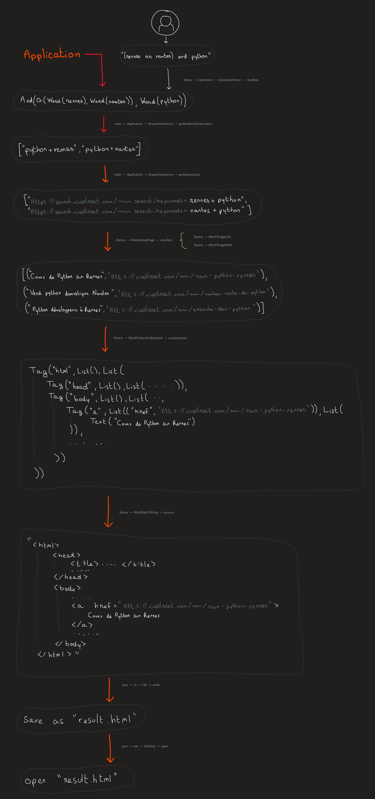
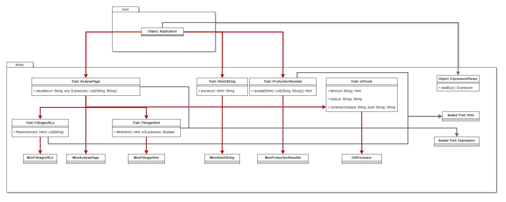

This is an application that web scrape for advert post on the website [vivastreet](https://www.vivastreet.com/) and list all the corresponding post related to the user query inside a web page.
This was a group project of 7.

Features :
- Search all the corresponding post that match the user input 
- Allow for OR, AND, NOT logic filter
- The matching results are displayed on a HTML page with styling 

# TP345-GEN-ALPHA

